# L'incroyable et rocambolesque aventure de Clem, la clémentine qui voulait apprendre la programmation.

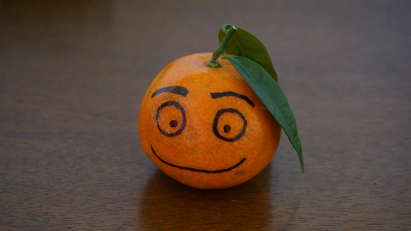

Elle, c’est Clem. Curieuse, aujourd’hui elle décide d'apprendre la programmation ! Après quelques recherches, elle découvre Zeste de Savoir…

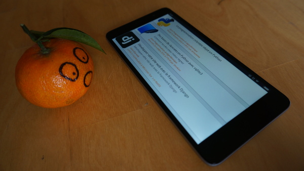

Sur ce site elle découvre pleins de tutoriels intéressants : sur Arduino, sur la géologie, sur les maths, … ah, il y en a un sur Python !

Trop cool ! Il y a aussi des articles : des nouvelles de Rosetta et Philae, une réflexion sur l’art libre, et même un roman collaboratif.

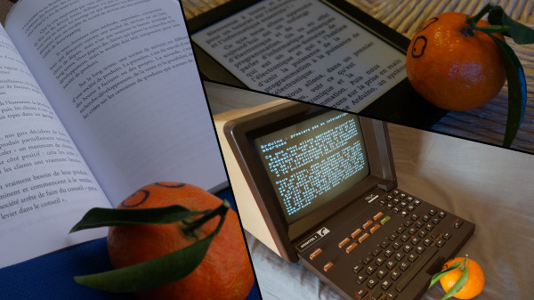

Elle découvre également qu’elle peut lire ces contenus sur son écran, sur sa liseuse e-book et même les exporter en PDF pour les imprimer.

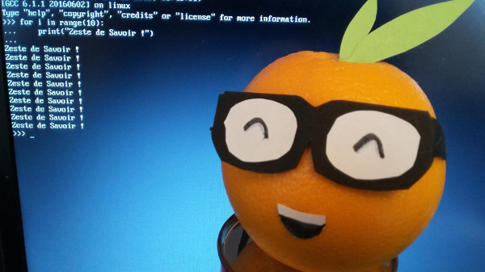

Clem apprend donc à programmer en Python, en suivant le tutoriel. Au bout d’un moment, elle décide de se lancer et fait son 1er programme !

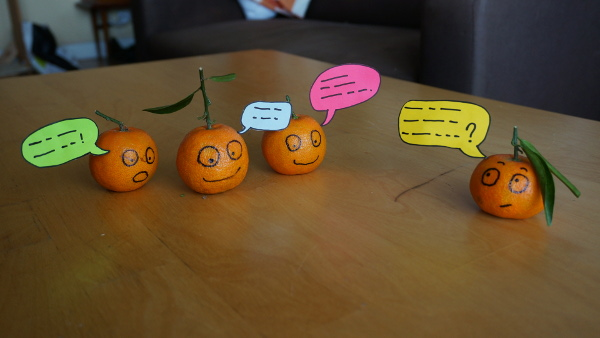

Mais elle rencontre un problème qui lui pose bien du tracas… elle se rend donc sur le forum où des membres l'aident et la conseillent.

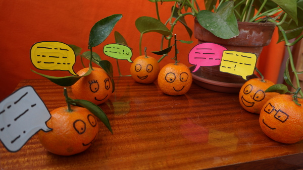

Elle en profite pour participer à d'autres sujets, juste pour le plaisir de discuter avec les autres. Elle en aide certains à son tour…

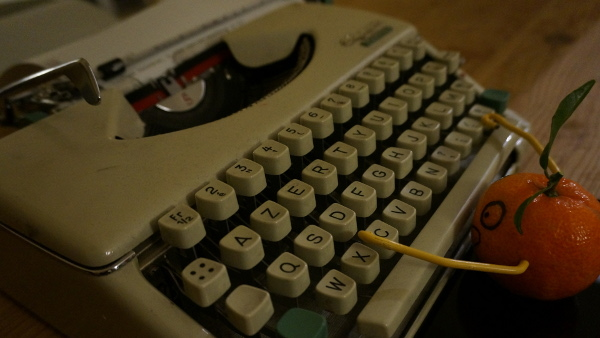

Clem prend part à la communauté. Elle se décide même à rédiger un tutoriel sur la couture, qui est relu est corrigé, avant d'être publié.

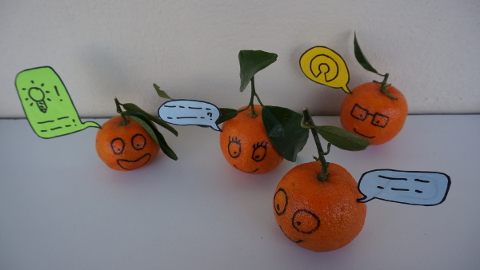

Elle trouve le site bien fait. Et pour cause : les améliorations du site sont suggérées, discutées et validées par les membres sur le forum.

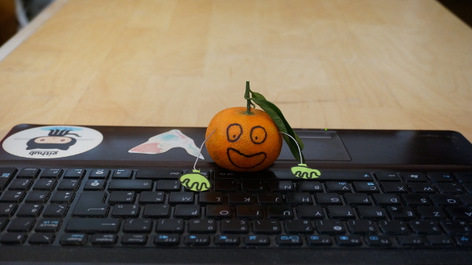

Découvrant que le site est open-source et codé en Python, Clem veut y contribuer. Ni une ni deux, l'équipe technique la prend sous son aile.

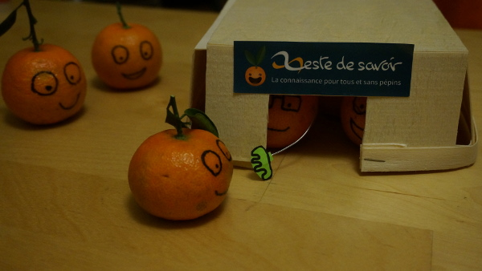

Elle apprend que derrière ce site il y a une association, permettant de préserver ses valeurs fondatrices et financer les infrastructures.

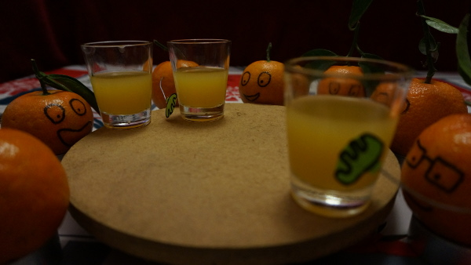

Clem décide donc d'aller rencontrer quelques membres en chair et en pulpe, lors des événements organisés. La voilà au Capitole du Libre ! :-D
