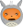

# PNG (Ancien) :

Syntaxe zMd  | Basse résolution                             | Haute résolution
-------------|----------------------------------------------|-----------------
`:)`         |        | 
`:D`         |          | 
`;)`         |          | 
`:p`         |          | 
`:lol:`      |            | 
`:euh:`      |            | 
`:(`         |            | 
`:o`         |            | 
`:colere:`   |        | 
`:colere2:`  |      | 
`o_O`        |        | 
`^^`         |          | 
`:-°`        |          | 
`:ange:`     |        | 
`:diable:`   |          | 
`:magicien:` |      | 
`:ninja:`    |        | 
`>_<`        |            | 
`:pirate:`   |      | 
`:'(`        |            | 
`:honte:`    |          | 
`:soleil:`   |          | 
`:waw:`      |            | 
`:zorro:`    |        | 
`:B`         |                | 
`:popcorn:`  |    | 
`^(;,;)^`    |    | 
∅            |  | 
