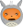

Syntaxe zMd  | Classique                                                                                         | Basse résolution                             | Haute résolution
-------------|---------------------------------------------------------------------------------------------------|----------------------------------------------|-----------------
`:)`         |      |        | 
`:D`         |     |          | 
`;)`         |        |          | 
`:p`         |      |          | 
`:lol:`      |         |            | 
`:euh:`      |       |            | 
`:(`         |       |            | 
`:o`         |          |            | 
`:colere:`   |      |        | 
`:colere2:`  |   |      | 
`o_O`        |      |        | 
`^^`         |        |          | 
`:-°`        |      |          | 
`:ange:`     |       |        | 
`:diable:`   |      |          | 
`:magicien:` |  |      | 
`:ninja:`    |      |        | 
`>_<`        |        |            | 
`:pirate:`   |    |      | 
`:'(`        |       |            | 
`:honte:`    |       |          | 
`:soleil:`   |      |          | 
`:waw:`      |          |            | 
`:zorro:`    |      |        | 
`:B`    |      |        | 
`:popcorn:`    |      |        | 
`^(;,;)^`    |  |        | 
∅            | ∅                                                                                                           |  | 
